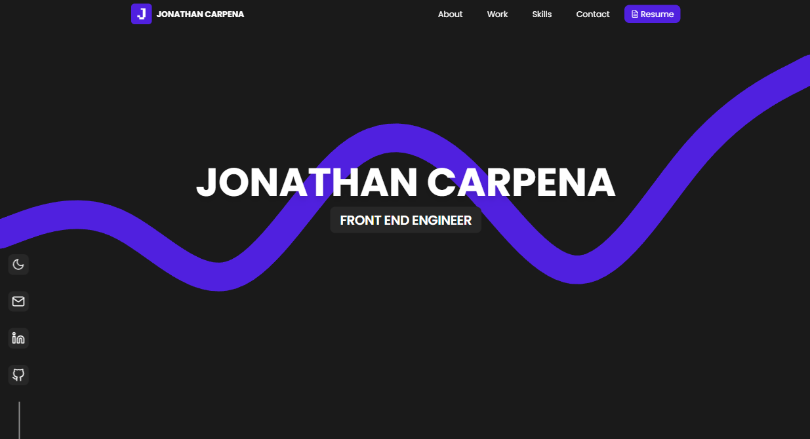
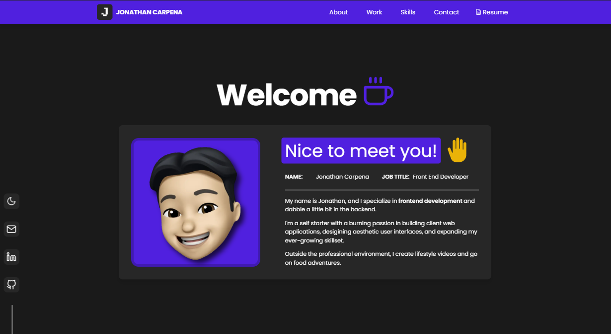
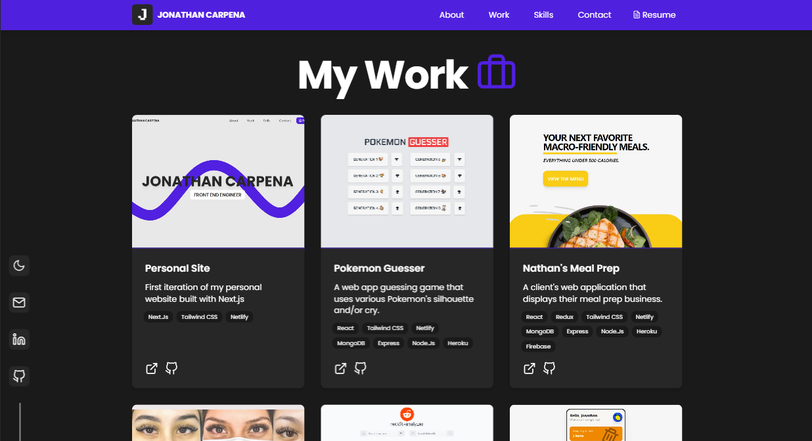
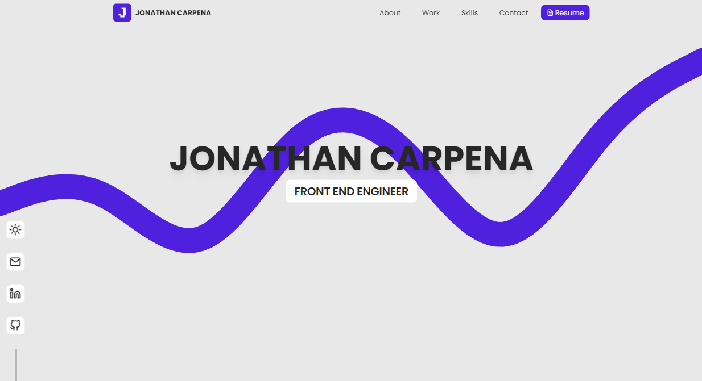
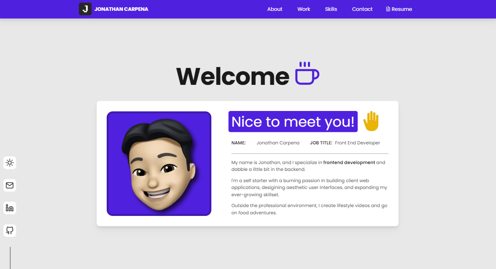
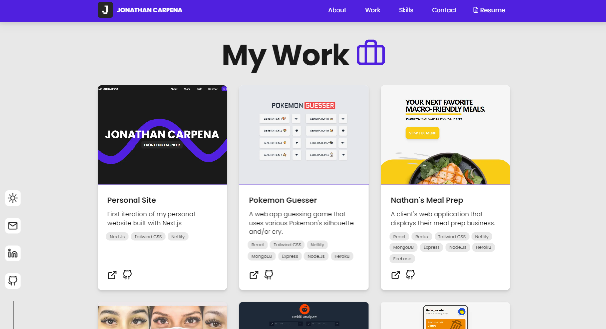
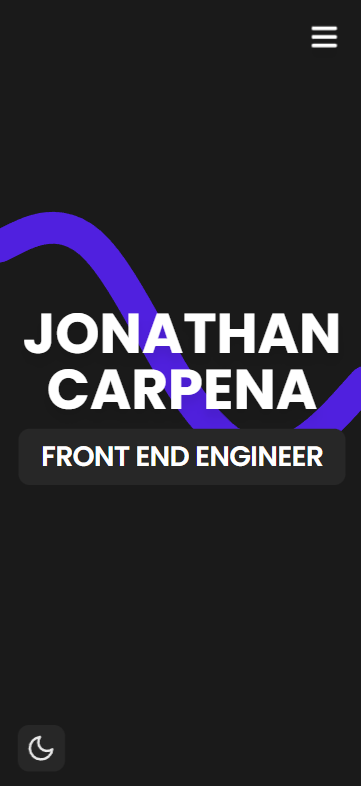
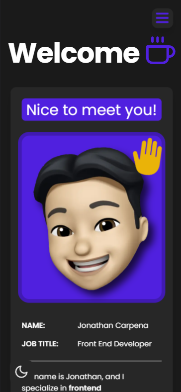
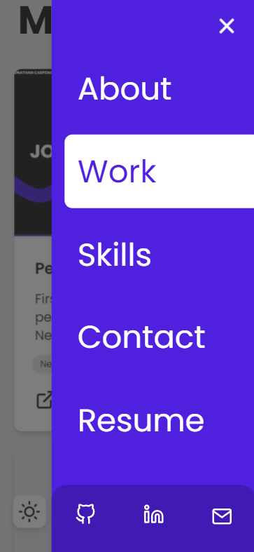

# jonathancarpena.com - v1

> The first iteration of
> <a href="https://jonathancarpena.me/" target="_blank" rel="noopener noreferrer">jonathancarpena.me</a>
> built with
> <a href="https://nextjs.org/" target="_blank" rel="noopener noreferrer">Next.js</a>
> and hosted with
> <a href="https://www.netlify.com/" target="_blank" rel="noopener noreferrer">Netlify</a>.

## 📸 Screenshots

<ul style="display:flex flex-direction:column">
 
 
 
</ul>

### Light Mode

<ul style="display:flex flex-direction:column">
 
 
 
</ul>

### Mobile

<ul style="display:flex flex-direction:column">
 
 
 
</ul>

## 🛠 Installation & Set Up

Clone down this repository. You will need node and npm installed globally on
your machine.

```
$ git clone https://github.com/jonathancarpena/portfolio.git
```

1. Install dependencies `npm install`

## 🚀 Building and Running for Production

Development mode. Open http://localhost:3000 to view it in the browser.

```
npm run dev
```

## 🎨 Color Reference

| Accent Color | Hex                                                                |
| ------------ | ------------------------------------------------------------------ |
| 100          |  `#dcd2f9` |
| 200          |  `#b9a6f2` |
| 300          |  `#9679ec` |
| 400          |  `#734de5` |
| 500          |  `#5020df` |
| 600          |  `#401ab2` |
| 700          |  `#301386` |
| 800          |  `#200d59` |
| 900          |  `#10062d` |

| Light Mode | Hex                                                                |
| ---------- | ------------------------------------------------------------------ |
| Light      |  `#e8e8e8` |
| Lighter    |  `#ffffff` |

| Dark Mode | Hex                                                                |
| --------- | ------------------------------------------------------------------ |
| Dark      |  `#272727` |
| Darker    |  `#1A1A1A` |
